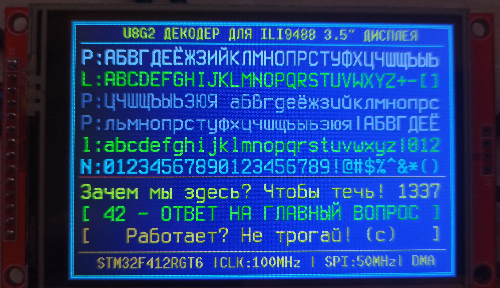

В данном проекте для отображения интерфейса на дисплее ILI9488 используются растровые (Bitmap) шрифты. 

* **Оригинальный набор растровых шрифтов:** Скачан из репозитория [Tecate/bitmap-fonts](https://github.com/Tecate/bitmap-fonts).
* **Шрифт основного интерфейса:** [Terminus Font v4.39](https://github.com) (модификация с полной поддержкой Unicode/Кириллицы).
* **Шрифт шапки и строки статуса:** Заводской моноширинный шрифт `u8g2_font_10x20_t_cyrillic` из библиотеки U8g2.

### Конвертация шрифтов
Для генерации файлов `.c` использовалась официальная консольная утилита `bdfconv.exe` из состава библиотеки [Olikraus U8g2](https://github.com/olikraus/u8g2) со следующими параметрами ограничения диапазонов символов (ASCII + Кириллица):
```bash
bdfconv.exe -v -f 1 -m "32-127,1024-1119" ter-u28b.bdf -n u8g2_font_terminus_28b_cyr -o terminus_u28b_cyr.c
```

