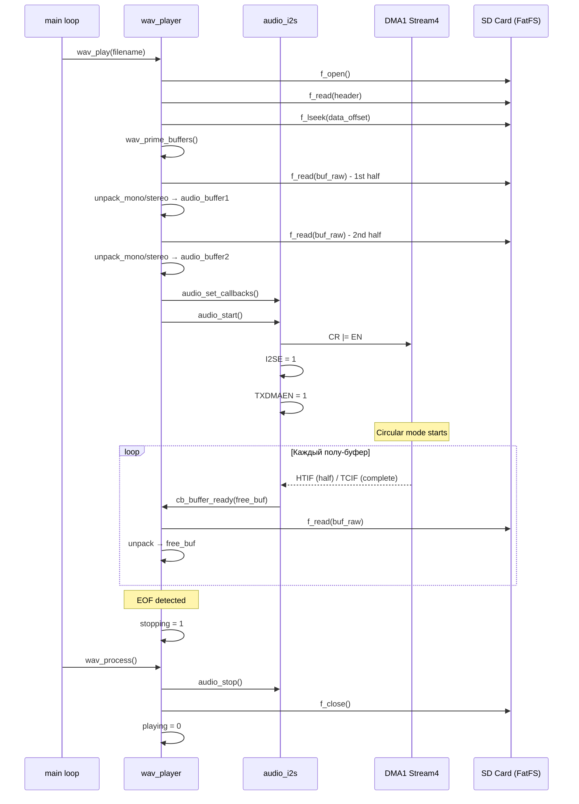
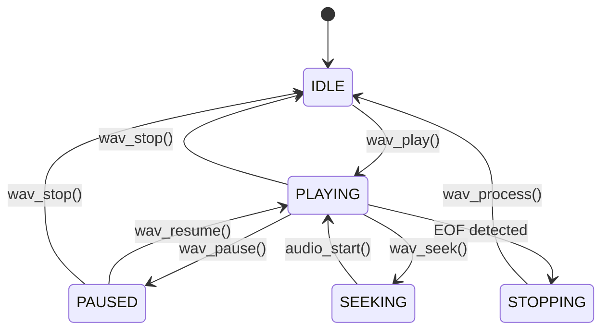

# Анализ модулей `audio_i2s` и `wav_player`

## 1. Общая архитектура

Система аудиовоспроизведения состоит из двух уровней:

```
┌─────────────────────────────────────────────────────────┐
│                    wav_player_ui.c                       │
│              (пользовательский интерфейс)                │
├─────────────────────────────────────────────────────────┤
│                     wav_player.c/h                       │
│          (логика воспроизведения WAV-файлов)             │
├─────────────────────────────────────────────────────────┤
│                     audio_i2s.c/h                        │
│        (низкоуровневый драйвер I2S + DMA на SPI2)        │
├─────────────────────────────────────────────────────────┤
│                      STM32F412 HAL                       │
│              (RCC, GPIO, SPI2, DMA1 Stream4)             │
└─────────────────────────────────────────────────────────┘
```

---

## 2. Модуль `audio_i2s` — драйвер I2S-звуковывода

### 2.1. Назначение

Обеспечивает непрерывный вывод 16-битного стереозвука через I2S-интерфейс (SPI2 в режиме I2S) на внешний ЦАП (PCM5102) с использованием DMA в циклическом режиме (Circular mode).

### 2.2. Аппаратная конфигурация

| Параметр | Значение |
|---|---|
| Периферия | SPI2, режим I2S Philips |
| Пины | PB12 (I2S2_WS), PB13 (I2S2_CK), PB15 (I2S2_SD) — все AF5 |
| DMA | DMA1 Stream4, Channel 0 (SPI2_TX) |
| Частота дискретизации | ~44.1 кГц |
| Формат фрейма | 16 бит данных в 32-битном слоте (CHLEN=1, DATLEN=00) |
| Режим DMA | Circular, Memory-to-Peripheral, 16-bit |

### 2.3. Буферная схема

```
audio_buffer[AUDIO_CHUNK_SIZE * 4]  (aligned(4), static)
├── Первая половина: audio_buffer[0 .. AUDIO_CHUNK_SIZE*2)  ← audio_get_buffer1()
└── Вторая половина: audio_buffer[AUDIO_CHUNK_SIZE*2 .. ]  ← audio_get_buffer2()
```

- `AUDIO_CHUNK_SIZE = 4096` стерео-фреймов
- Размер половины: `4096 × 2 канала × 2 байта = 16384 байта`
- Общий размер буфера: `32768 байт`

### 2.4. Поток данных

```
PLLI2S: HSE(8MHz) / 8 × 192 / 2 = 96 MHz
  → I2SDIV=17, ODD=0 → делитель 128×17 = 2176
  → Fs = 96,000,000 / 2176 ≈ 44,117.6 Гц ≈ 44.1 кГц
  → BCK = 96,000,000 / (2 × 17) ≈ 2.82 МГц
```

### 2.5. Механизм DMA-прерываний (double-buffering)

DMA работает в Circular mode на всём буфере целиком. Прерывания:

| Событие | Флаг | Когда срабатывает | Какой буфер свободен |
|---|---|---|---|
| Half Transfer (HTIF) | `DMA_HISR_HTIF4` | Середина буфера | Первая половина (`get_buffer1`) |
| Transfer Complete (TCIF) | `DMA_HISR_TCIF4` | Конец буфера (циклический возврат) | Вторая половина (`get_buffer2`) |

Обработчик прерывания `DMA1_Stream4_IRQHandler`:
1. Читает `DMA1->HISR` для определения причины
2. Сбрасывает все флаги (`HIFCR = 0x3DU`)
3. Вызывает `callbacks.on_buffer_ready(free_buffer)` — пользовательский коллбэк

### 2.6. Публичный API

```c
uint16_t* audio_get_buffer1(void);     // Указатель на первую половину буфера
uint16_t* audio_get_buffer2(void);     // Указатель на вторую половину буфера
void audio_set_callbacks(audio_callbacks_t* cb);  // Установка коллбэка
void audio_init(void);                 // Инициализация PLLI2S, GPIO, SPI/I2S, DMA
void audio_start(void);                // Запуск: DMA → I2SE → TXDMAEN
void audio_stop(void);                 // Останов: TXDMAEN → DMA → I2SE
```

### 2.7. Критический порядок запуска/остановки

**Старт** (строгий порядок, исправленный после устранения артефактов):
1. `DMA1_Stream4->CR |= DMA_SxCR_EN` — включить DMA-стрим
2. `SPI2->I2SCFGR |= SPI_I2SCFGR_I2SE` — включить I2S
3. `SPI2->CR2 |= SPI_CR2_TXDMAEN` — разрешить DMA-запросы от передатчика

**Стоп** (обратный порядок):
1. Отключить TXDMAEN
2. Отключить DMA (с ожиданием снятия флага EN)
3. Сбросить все флаги DMA
4. Отключить I2SE

---

## 3. Модуль `wav_player` — логика воспроизведения WAV

### 3.1. Назначение

Читает WAV-файлы с SD-карты (через FatFS), парсит заголовок, распаковывает моно/стерео сэмплы в DMA-буфер и управляет состояниями воспроизведения.

### 3.2. Структура WAV-заголовка

```c
typedef struct __attribute__((packed)) {
    char     chunk_id[4];      // "RIFF"
    uint32_t chunk_size;
    char     format[4];        // "WAVE"
    char     subchunk1_id[4];  // "fmt "
    uint32_t subchunk1_size;   // 16 для PCM
    uint16_t audio_format;     // 1 = PCM
    uint16_t num_channels;     // 1=моно, 2=стерео
    uint32_t sample_rate;
    uint32_t byte_rate;
    uint16_t block_align;
    uint16_t bits_per_sample;
    char     subchunk2_id[4];  // "data"
    uint32_t subchunk2_size;
} wav_header_t;
```

### 3.3. Глобальное состояние

```c
static FATFS    fs;              // Файловая система FatFS
static FIL      file;            // Открытый WAV-файл
static uint8_t  playing;         // Флаг воспроизведения
static uint8_t  eof;             // Флаг конца файла
static uint8_t  stopping;        // Флаг запроса остановки
static uint16_t channels;        // 1=моно, 2=стерео
static uint32_t bytes_left;      // Осталось байт для чтения
static uint32_t sample_rate;     // Частота дискретизации
static uint32_t current_position;// Текущая позиция в байтах от начала данных
static uint32_t total_data_size; // Общий размер аудиоданных
static uint16_t buf_raw[AUDIO_CHUNK_SIZE * 2];  // Промежуточный буфер для чтения с SD
```

### 3.4. Поток воспроизведения

```
wav_play("0:/MUSIC/TRACK.WAV")
  │
  ├─ 1. Если уже играет → остановить и закрыть файл
  ├─ 2. Монтировать FatFS (однократно)
  ├─ 3. f_open() — открыть WAV-файл
  ├─ 4. Прочитать и проверить заголовок (RIFF/WAVE/PCM/16bit)
  ├─ 5. Вычислить total_data_size (из subchunk2_size или f_size - 44)
  ├─ 6. f_lseek() — перейти к данным (offset 44)
  ├─ 7. wav_prime_buffers() — заполнить обе половины DMA-буфера
  ├─ 8. audio_set_callbacks(cb_buffer_ready)
  ├─ 9. playing = 1
  └─ 10. audio_start() — запуск I2S+DMA
```

### 3.5. Double-buffering через DMA

```
DMA IRQ (HTIF/TCIF)
  │
  └─ cb_buffer_ready(buf)
       │
       └─ wav_fill_buffer(buf)
            │
            ├─ Определить размер чанка (моно: chunk×2, стерео: chunk×4)
            ├─ Если bytes_left == 0 → заполнить тишиной, eof=stopping=1
            ├─ f_read(&file, buf_raw, n, &br) — чтение с SD-карты
            ├─ bytes_left -= br; current_position += br
            ├─ unpack_mono(buf, buf_raw, br/2) или unpack_stereo(buf, buf_raw, br)
            └─ Если br < chunk → заполнить остаток тишиной, eof=1
```

### 3.6. Режимы распаковки (compile-time выбор)

| Макрос | Моно | Стерео | Описание |
|---|---|---|---|
| `WAV_MODE_FAST_HALF` (по умолч.) | `sample >> 1` | `sample >> 1` | Быстрый, деление на 2 |
| `WAV_MODE_AMPLITUDE` | `sample * 200 >> 8` | `sample * 200 >> 8` | Точный, с коэффициентом |
| `WAV_MODE_PASSTHROUGH` | без изменений | `memcpy` | Прямой, без обработки |

**Важно:** Моно → стерео: сэмпл дублируется в L и R каналы.

### 3.7. Управление воспроизведением

| Функция | Действие |
|---|---|
| `wav_play(filename)` | Запуск нового трека |
| `wav_stop()` | Немедленная остановка + закрытие файла |
| `wav_pause()` | Остановка DMA (I2S замолкает) |
| `wav_resume()` | Запуск DMA (продолжение с текущей позиции) |
| `wav_process()` | Вызывается в главном цикле; обрабатывает `stopping` → остановка по окончании |
| `wav_seek(new_pos)` | Перемотка: стоп DMA → f_lseek → prime_buffers → старт DMA |

### 3.8. Перемотка (seek)

```
wav_seek(new_position)
  │
  ├─ Выравнивание по аудиокадру: new_position -= new_position % (channels * 2)
  ├─ Проверка границ (не выходить за total_data_size)
  ├─ audio_stop()
  ├─ f_lseek(&file, wav_data_offset + new_position)
  ├─ current_position = new_position
  ├─ bytes_left = total_data_size - current_position
  ├─ wav_prime_buffers() — перезаполнить оба буфера
  └─ audio_start()
```

### 3.9. Обработка окончания файла

```
wav_fill_buffer() обнаруживает br < chunk или bytes_left == 0
  → заполняет остаток тишиной
  → eof = 1, stopping = 1

wav_process() (в главном цикле):
  if (stopping && playing):
    → audio_stop()
    → f_close(&file)
    → playing = 0, stopping = 0, eof = 0
```

---

## 4. Схема взаимодействия с UI-слоем

```
wav_playerui_process()  [вызывается в main loop]
  │
  ├─ wav_process() — обработка остановки по окончании
  ├─ Если !playing && !paused → play_next = 1
  ├─ Если play_next && !paused:
  │     └─ start_next_track() → wav_play(next_file)
  └─ Если playing && !paused:
        └─ update_playback() — обновление прогресс-бара и времени
```

---

## 5. Потенциальные проблемы и особенности

### 5.1. Размер `buf_raw`
```c
static uint16_t buf_raw[AUDIO_CHUNK_SIZE * 2];  // 4096 × 2 = 8192 half-word = 16384 байта
```
Этот буфер используется как промежуточный для чтения с SD-карты. Для стерео читается `AUDIO_CHUNK_SIZE * 4 = 16384` байта, что **превышает размер buf_raw** (16384 байта против 16384 байт — на грани). Для моно читается `AUDIO_CHUNK_SIZE * 2 = 8192` байта — безопасно.

**Расчёт:**
- `chunk` для стерео: `4096 × 4 = 16384` байта
- `buf_raw` размер: `4096 × 2 × 2 = 16384` байта
- Формально размер совпадает, но запас отсутствует.

### 5.2. `wav_data_offset` — жёстко задано 44
Большинство WAV-файлов имеют 44-байтный заголовок, но некоторые могут содержать дополнительные чанки (например, `LIST`, `fact`). В таких случаях `wav_data_offset = 44` приведёт к чтению не с того места.

### 5.3. Отсутствие проверки `bits_per_sample`
Код предполагает 16-битные сэмплы, но не проверяет `hdr.bits_per_sample`. Если файл 8-битный или 24-битный, распаковка будет некорректной.

### 5.4. `wav_seek()` — нет проверки на `!playing`
В отличие от `wav_pause()`/`wav_stop()`, `wav_seek()` не проверяет флаг `playing` в начале. Однако он вызывается только из `button1_hold`/`button3_hold`, где проверка есть.

### 5.5. Гонка состояния `stopping`
Флаг `stopping` устанавливается в `wav_fill_buffer()` (из прерывания DMA) и проверяется в `wav_process()` (из main loop). Это безопасно, т.к.:
- `stopping` — `uint8_t` (атомарное чтение/запись на Cortex-M4)
- Нет критической секции, где чтение и запись пересекаются

### 5.6. `wav_prime_buffers()` не проверяет `eof`
Если файл короче одного DMA-полубуфера, `wav_fill_buffer()` установит `eof=1` уже при заполнении первого буфера. Второй буфер заполнится тишиной, и после старта DMA сразу же сработает остановка. Это корректное поведение.

---

## 6. Диаграмма последовательности воспроизведения



---

## 7. Диаграмма состояний wav_player



---

## 8. Ключевые выводы

1. **Архитектура double-buffering** через DMA Circular mode с HTIF/TCIF прерываниями — классический и эффективный подход для аудиовывода без защелкиваний.

2. **Разделение ответственности** чёткое: `audio_i2s` занимается только аппаратной передачей, `wav_player` — файловым вводом-выводом и распаковкой.

3. **Производительность**: чтение с SD-карты происходит только в прерывании DMA, что минимизирует задержки. Размер чанка 4096 сэмплов при 44.1 кГц даёт ~92 мс на полу-буфер — достаточно времени для безопасного чтения с SD.

4. **Гибкость распаковки**: compile-time выбор режима (FAST_HALF/AMPLITUDE/PASSTHROUGH) без runtime-оверхеда.

5. **Порядок включения I2S+DMA** критичен — был исправлен для устранения аналоговых артефактов.